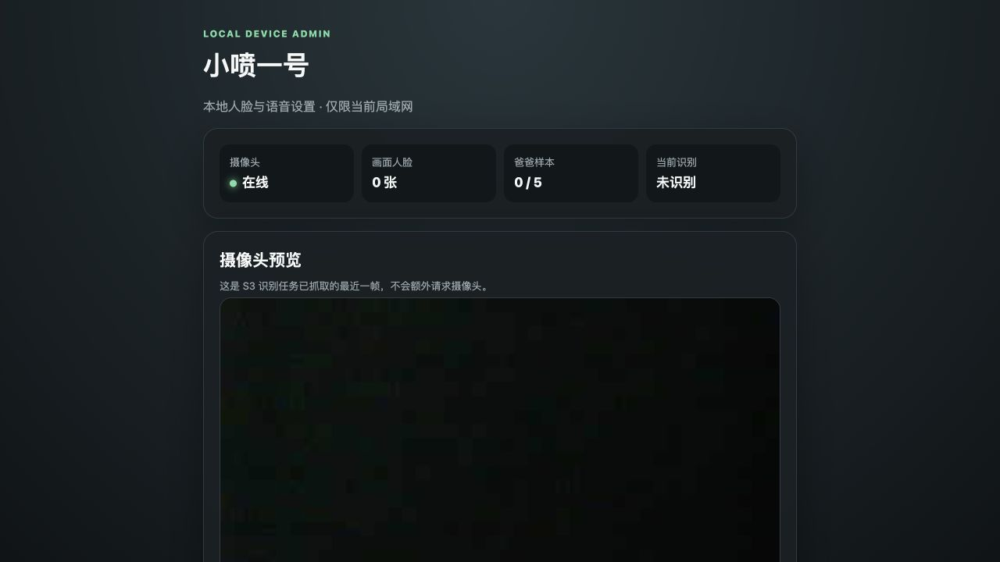
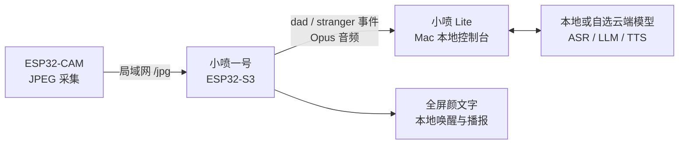

# 小喷一号固件（XiaoPen ESP32）

> 为 CoolKit XZ-02 / ESP32-S3 N16R8 打造的本地优先桌面宠物与家庭语音终端。

[](LICENSE)
[](https://github.com/espressif/esp-idf)
[](#硬件材料)

小喷一号把唤醒、录音、全屏颜文字、人脸事件和语音播报放在一块
ESP32-S3 开发板上运行。模型、Prompt、API Key 和隐私策略由 Mac 上的
[小喷 Lite](https://github.com/jiaqianjing/xiaopen-lite) 管理，固件不依赖第三方
设备后台。

## 产品界面



设备连接 Wi-Fi 后，同一局域网中的浏览器可以查看摄像头状态、最近一帧预览、
爸爸样本数、识别结果、唤醒词和门口播报测试。

## 功能

- 全屏桌面宠物颜文字：眨眼、视线移动，以及高兴、伤心、生气、思考、困倦、
  惊讶等情绪
- 本地自定义唤醒：默认“`小喷小喷`”，可在设备管理页修改显示文字、拼音和阈值
- 语音交互：通过 XiaoPen Device Protocol v1 与自托管网关交换 Opus 音频
- 本地 OTA 发现：从局域网中的小喷 Lite 获取 WebSocket 地址和设备 Token
- ESP32-CAM 联动：拉取局域网 JPEG，在 S3 上完成检测、特征提取和比对
- 人脸录入：保存最多 5 份爸爸特征向量，不保存原始照片
- 即兴门口播报：只向 LLM 提交 `dad` / `stranger` 身份事件，不提交人脸图片
- 离线兜底：网关或模型不可用时播放固件内置的固定提示音
- 局域网管理页：无需外部字体、脚本、CDN 或云端账号

## 系统架构



ESP32-CAM 只负责采集，S3 负责设备交互，小喷 Lite 负责模型编排。三个组件可以
独立替换或升级。

## 硬件材料

| 材料 | 规格 | 数量 | 用途 |
| --- | --- | ---: | --- |
| 主控板 | CoolKit XZ-02，ESP32-S3 N16R8 | 1 | 唤醒、录音、显示和播报 |
| 显示屏 | 板载 1.54 英寸 240×240 TFT | 1 | 全屏颜文字 |
| 音频硬件 | 板载麦克风、Codec 与扬声器 | 1 套 | 语音输入输出 |
| 门口摄像头 | AI-Thinker ESP32-CAM + OV2640 | 1 | JPEG 图像采集，可选 |
| 主机 | Mac 或其他可运行小喷 Lite 的电脑 | 1 | 模型与设备网关 |
| 网络 | 2.4 GHz Wi-Fi 局域网 | 1 | 设备互联 |
| 烧录线 | 支持数据传输的 USB-C 线 | 1 | 固件烧录与串口日志 |

ESP32-CAM 固件单独维护在
[jiaqianjing/esp32-cam-learning](https://github.com/jiaqianjing/esp32-cam-learning)。

## 默认行为

- 唤醒词：`小喷小喷`（识别拼音 `xiao pen xiao pen`）
- 唤醒回应：本地音频“我在呢”
- 摄像头地址：`http://192.168.31.91/jpg`
- 设备管理页：`http://设备IP:8080`
- 本地网关 OTA：通过 `CONFIG_OTA_URL` 设置
- 人脸数据库：Flash `/face` 分区，仅保存特征向量

没有爸爸样本时，设备不会把看到的人直接判定为陌生人，而是先提示录入样本。

## 按键

| 操作 | 功能 |
| --- | --- |
| 中间键单击 | 开始或停止对话；首次启动进入配网 |
| 中间键双击 | 录入一份爸爸人脸特征 |
| 中间键长按 | 显示设备管理页地址 |
| 减号键双击 | 清空全部爸爸人脸特征 |
| 加减号单击或长按 | 调节音量 |

## 构建

需要 ESP-IDF 5.5.2：

```bash
git clone https://github.com/jiaqianjing/xiaopen-esp32.git
cd xiaopen-esp32

source /path/to/esp-idf/export.sh
python scripts/release.py coolkit-xz-02 --name coolkit-xz-02
```

首次执行发布脚本会选择 CoolKit XZ-02、16 MB 人脸分区和小喷自定义唤醒模型。
之后可用 `idf.py build` 做增量构建。主要输出为：

```text
build/xiaopen.bin
releases/v2.3.0_coolkit-xz-02.zip
```

如需修改本地网关地址：

```bash
idf.py menuconfig
```

进入 `XiaoPen Assistant` → `Default OTA URL`，填写：

```text
http://你的Mac局域网IP:8091/xiaopen/ota/
```

## 烧录

先确认端口属于 ESP32-S3，再执行：

```bash
idf.py -p /dev/cu.usbmodemXXXX flash monitor
```

当前分区设计会写入 bootloader、应用、分区表和资源分区，不会主动擦除 NVS
Wi-Fi 配置或 `/face` 人脸特征分区。量产或更换分区表前仍应先备份重要数据。

## 本地设备管理

设备联网后长按中间键查看 IP，然后访问：

```text
http://设备IP:8080
```

管理页具备以下安全边界：

- 只接受与设备相同子网的 IPv4 请求
- 写操作需要每次启动随机生成的页面 Token
- 摄像头预览只保存在 PSRAM，下一帧覆盖，断电消失
- 原始图片不写入 Flash，也不发送给 LLM
- 模型 API Key 只保存在运行小喷 Lite 的电脑上

## 项目结构

```text
xiaopen-esp32/
├── main/
│   ├── application.*                 # 设备状态与语音会话
│   ├── boards/coolkit-xz-02/         # 小喷一号板级实现
│   ├── audio/                        # 唤醒、录音和音频播放
│   ├── display/                      # LVGL 显示层
│   └── protocols/                    # XiaoPen 设备协议兼容层
├── partitions/                       # Flash 分区配置
├── scripts/                          # 构建与发布脚本
└── sdkconfig                         # 当前产品构建配置
```

仓库保留了部分上游板卡驱动和内部 `CONFIG_XIAOZHI_*` 配置符号作为兼容层。
它们不会进入 CoolKit XZ-02 的最终应用镜像，也不会使设备连接任何官方服务器；
保留这些代码是为了以后扩展其他 ESP32 硬件时不必重新移植底层音频和显示驱动。

## 隐私与网络边界

- 当前固件只使用 `CONFIG_OTA_URL` 指向的自托管网关
- XiaoPen Device Protocol 使用局域网 HTTP/WebSocket，不应直接映射到公网
- ESP32-CAM 和 S3 之间传输 JPEG 时应使用可信家庭局域网
- 允许云端模型处理哪些数据，由小喷 Lite 的隐私策略显式控制

## 上游来源与 License

本项目固件最初衍生自
[78/xiaozhi-esp32](https://github.com/78/xiaozhi-esp32)，并保留其硬件抽象、
音频管线及部分协议消息结构。小喷一号拥有独立产品名称、固件产物、局域网协议
路径和自托管控制面，不依赖上游官方服务器。

本项目遵循 [MIT License](LICENSE)。根据许可要求，上游版权声明保留在 LICENSE
和相关源文件中。
